# School_District_Analysis

## Overview of the school district analysis:

This assignment is to analyse standardized test data to provide reporting, analysis, and insights about performance trends and patterns. The insights are used for strategic decisions regarding school funding. Data is aggregated to help the school board and superintent to make decisions regarding school budgets and priorities.

Based on the outcomes from the prior analysis, the school board has notified that the data shows evidence of academic dishonesty; specifically, reading and math grades for Thomas High School ninth graders appear to have been altered. Although the school board does not know the full extent of the academic dishonesty, they want to uphold state-testing standards and need help. The assignment is to replace the math and reading scores for Thomas High School with NaNs while keeping the rest of the data intact. Once the math and reading scores for Thomas High School have been replaced, the school district analysis will be repeated and a report written up to describe how these changes affected the overall analysis.

Starting with the cleaned student data in the file [clean_students_complete.csv](Resources/clean_students_complete.csv) and the information about the schools in the school district in the file [schools_complete.csv](Resources/schools_complete.csv) I have performed technical analysis by replacing ninth-grade reading and math scores for Thomas High School and repeated the school district analysis.  This report contains the outcomes of the analysis.

## Results:

In this section, I am using bulleted lists and images of DataFrames as support to address the results of the revised analysis.

- **How is the district summary affected?**

The following table shows the school district analysis report including the 9th grade math and reading scores from Thomas High School:

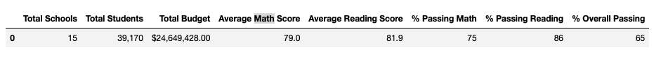

The following table shows the school district analysis report with 9th grade math and reading scores from Thomas High School removed and replaced with NaN:

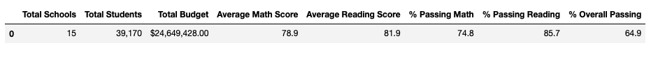

By comparing the school district analysis report from before and after, we can see that the scores for the school district are slightly lower. The average math score in the school district is lower and percentage of students who passed math and reading in the school district is lower as well as overall passing students percentage in the school district is lower. The average reading score in the school district has not significantly changed.

- **How is the school summary affected?**

The following table shows the per school summary report including the 9th grade math and reading scores from Thomas High School:

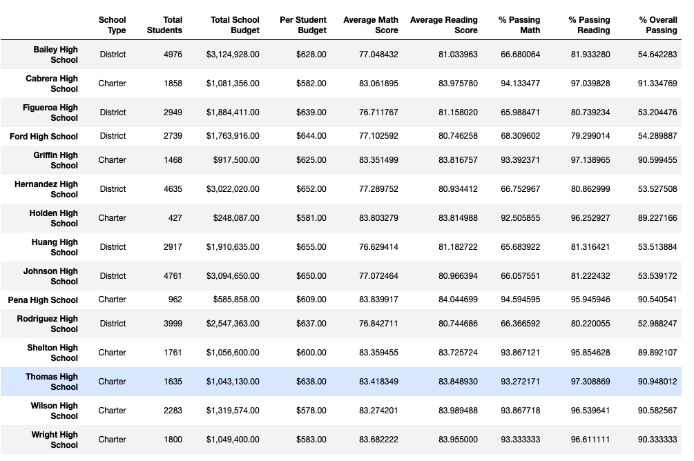

The following table shows the per school summary report with 9th grade math and reading scores from Thomas High School removed and replaced with NaN:

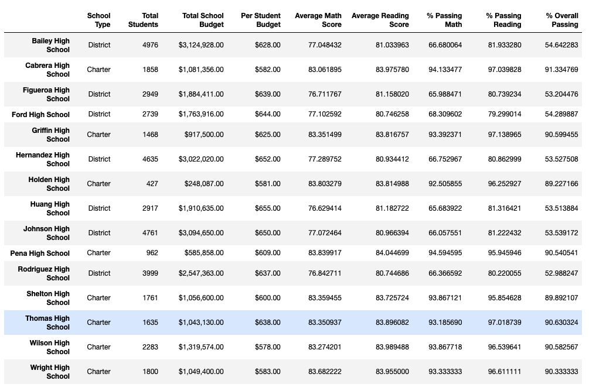

By comparing the per school summary report from before and after, we can see that the average math and reading scores as well as the percentage of students passing math, the percentage of students passing reading, as well as the overall passing percentage for Thomas High School are all lower.

- ***How does replacing the ninth graders’ math and reading scores affect Thomas High School’s performance relative to the other schools?***

The following table shows the ranking of Thomas High School including the 9th grade math and reading scores:

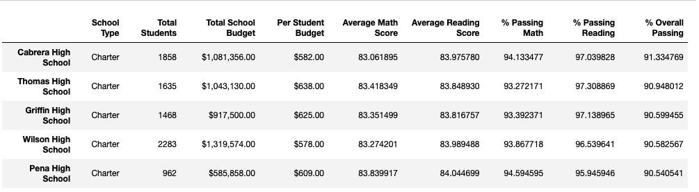

The following table shows the ranking of Thomas High School with 9th grade math and reading scores from Thomas High School removed and replaced with NaN:

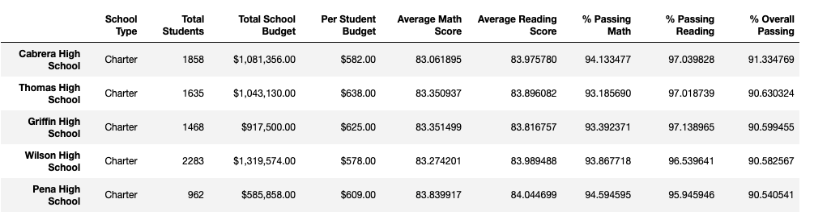

The comparison of the before and after ranking shows that Thomas High School was still able to keep the 2nd highest ranking based on percentage of overall passing in the school district. Griffin High School is ranked third and the gap between Thomas High School and Griffin High School has narrowed.

- ***How does replacing the ninth-grade scores affect the following:***
    - **Math and reading scores by grade**

The following table shows the math scores by grade including the 9th grade math scores for Thomas High School:

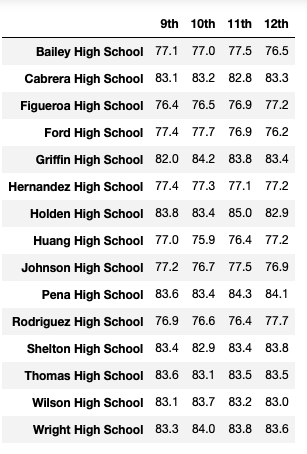

The following table shows the math scores by grade with 9th grade math scores from Thomas High School removed and replaced with NaN:

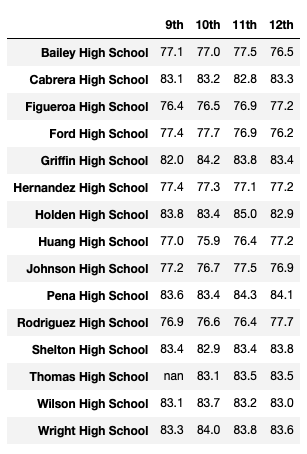

The comparison of the before and after scores by school spending shows that there is no difference in the table and the removal of the 9th grade scores of Thomas High School did not change the outcome of this analysis.

The following table shows the reading scores by grade including the 9th grade reading scores for Thomas High School:

The following table shows the reading scores by grade with 9th grade reading scores from Thomas High School removed and replaced with NaN:

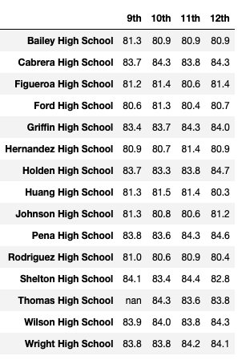

The comparison of the before and after reading scores by grade shows that the the reading scores for Thomas High School 9th grade have been replaced with NaN. There is no other change in the reading scores by grade.

    - **Scores by school spending**

The following table shows the scores by school spending including the 9th grade scores for Thomas High School:

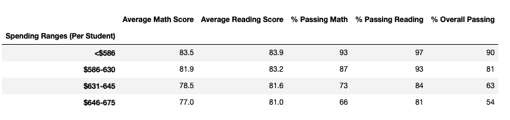

The following table shows the scores by school spending with 9th grade  scores from Thomas High School removed and replaced with NaN:

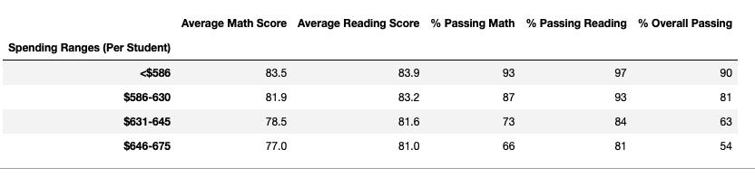

The comparison of the before and after  scores by school spending shows that the data in the table is the same and removing the scores for Thomas High School 9th grade did not change the outcome. 

    - **Scores by school size**

The following table shows the scores by school size including the 9th grade scores for Thomas High School:

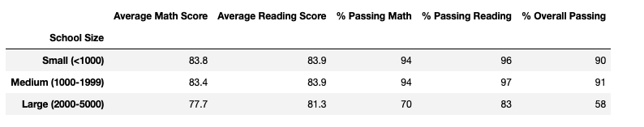

The following table shows the scores by school size with 9th grade  scores from Thomas High School removed and replaced with NaN:

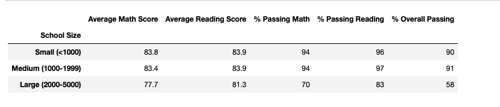

The comparison of the before and after  scores by school size shows that the data in the table is the same and removing the scores for Thomas High School 9th grade did not change the outcome.

    - **Scores by school type**

The following table shows the scores by school type including the 9th grade scores for Thomas High School:

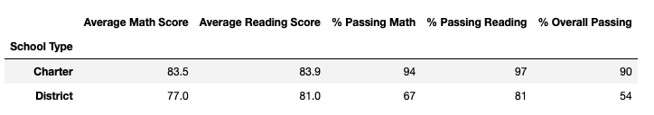

The following table shows the scores by school type with 9th grade  scores from Thomas High School removed and replaced with NaN:

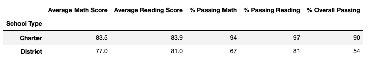

The comparison of the before and after  scores by school type shows that the data in the table is the same and removing the scores for Thomas High School 9th grade did not change the outcome.

## Summary:

This section summarizes four changes in the updated school district analysis after reading and math scores for the ninth grade at Thomas High School have been replaced with NaNs.

1. By comparing the school district analysis report from before and after, we can see that the scores for the school district are slightly lower. The average math score in the school district is lower and percentage of students who passed math and reading in the school district is lower as well as overall passing students percentage in the school district is lower. The average reading score in the school district has not significantly changed.
2. By comparing the per school summary report from before and after, we can see that the average math and reading scores as well as the percentage of students passing math, the percentage of students passing reading, as well as the overall passing percentage for Thomas High School are all lower.
3. The comparison of the before and after ranking shows that Thomas High School was still able to keep the 2nd highest ranking based on percentage of overall passing in the school district. Griffin High School is ranked third and the gap between Thomas High School and Griffin High School has narrowed.
4. The school district does not have scores for 9th grade at Thomas High School since those scores have been removed. Removing those scores caused slight changes for averages and percentages at the school district level but overall does not impact the ranking of the schools in the school district, or the school districts scores by school spending, school size, or school type.   

